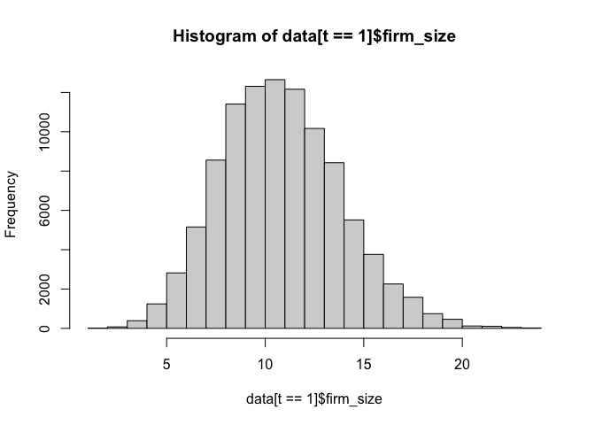

#---
#title: "Simulation on AKM fixed effects"
#date: "26 September, 2023"
#output:
#  html_document: 
#    toc: yes
#    toc_float:
#      collapsed: no
#      smooth_scroll: no
#    keep_md: yes
#---

The goal of the following simulation is to develop our understanding of the two-way fixed effect model. See the original paper by [Abowd Kramartz and Margolis](http://onlinelibrary.wiley.com/doi/10.1111/1468-0262.00020/full).


# Constructing Employer-Employee matched data

## Simulating a network

One central piece is to have a network of workers and firms over time. We then start by simulating such an object. The rest of the simulation will focus on adding wages to this model. As we know, a central issue of the network will be the number of movers.

We are going to model the mobility between workers and firms. Given a transition matrix we can solve for a stationary distrubtion, and then construct our panel from there.


```r
nk = 30
nl = 10


## Calibration to CHK data
# psi_sd = 0.16
# alpha_sd = 0.29
# w_sigma = 0.37

alpha_sd = 1
psi_sd   = 1

# let's draw some FE
psi   = qnorm(1:nk/(nk+1)) * alpha_sd
alpha = qnorm(1:nl/(nl+1)) * psi_sd

# let's assume moving PR is fixed
lambda = 0.05

csort = 0.5 # sorting effect
cnetw = 0.2 # network effect
csig  = 0.5 

# lets create type specific transition matrices
# we are going to use joint normal centered on different values
G = array(0,c(nl,nk,nk)) # def: conditional distribution k,k' given l
for (l in 1:nl) for (k in 1:nk) {
  #G[l,k,] = dnorm(csort*(psi[k] - alpha[l])) * dnorm(cnetw*(psi[k] - psi))
  G[l,k,] = dnorm( psi - cnetw *psi[k] - csort * alpha[l],sd = csig)
  #G[l,k,] = (dnorm(csort*(psi[k] - alpha[l])) + dnorm(cnetw*(psi[k] - psi)))/2
  G[l,k,] = G[l,k,]/sum(G[l,k,])
}


# we then solve for the stationary distribution over psis for each alpha value
H = array(1/nk,c(nl,nk))
for (l in 1:nl) {
 M = G[l,,]
 for (i in 1:100) {
   H[l,] = t(G[l,,]) %*% H[l,]
 }
}

Plot1=wireframe(G[1,,],aspect = c(1,1),xlab = "previous firm",ylab="next firm")
Plot2=wireframe(G[nl,,],aspect = c(1,1),xlab = "previous firm",ylab="next firm")
grid.arrange(Plot1, Plot2,nrow=1)
```

<!-- -->

And we can plot the joint distribution of matches


```r
wireframe(H,aspect = c(1,1),xlab = "worker",ylab="firm")
```

<!-- -->

The next step is to simulate our network given our transitions rules. 


```r
nt = 5
ni = 100000

# we simulate a panel
network    = array(0,c(ni,nt))
spellcount = array(0,c(ni,nt))
A = rep(0,ni)

for (i in 1:ni) {
  # we draw the worker type
  l = sample.int(nl,1)
  A[i]=l 
  # at time 1, we draw from H
  network[i,1] = sample.int(nk,1,prob = H[l,])
  for (t in 2:nt) {
    if (runif(1)<lambda) { #movers
      network[i,t] = sample.int(nk,1,prob = G[l,network[i,t-1],])
      spellcount[i,t] = spellcount[i,t-1] +1
    } else { # stayers
      network[i,t]    = network[i,t-1]
      spellcount[i,t] = spellcount[i,t-1]
    }
  }
}

data  = data.table(melt(network,c('i','t'))) 
data2 = data.table(melt(spellcount,c('i','t')))
setnames(data,"value","k") # firm type
data <- data[,spell := data2$value] # number of spells
data <- data[,l := A[i],i] # worker type
data <- data[,alpha := alpha[l],l] # worker FE
data <- data[,psi := psi[k],k] # firm FE
```


The final step is assigning identities to firms. We are going to do this by randomly assigning firm ids to spells.


```r
firm_size = 10
within_firm_count = ni/(firm_size*nk*nt)

dspell <- data[,list(len=.N),list(i,spell,k)] #length of the spell in each firm by worker
dspell <- dspell[,fid := sample( 1: pmax(1,sum(len)/(firm_size*nt) ) ,.N,replace=TRUE) , k]
dspell <- dspell[,fid := .GRP, list(k,fid)]

setkey(data,i,spell)
setkey(dspell,i,spell)

data <- data[, fid:= dspell[data,fid]]
```
<span class="label label-success">Task 1</span> Compute:
 - mean firm size, in the crossection, expect something like 15.
 - mean number of movers per firm in total in our panel (a worker that moved from firm i to j is counted as mover in firm i as well as in firm j).


```r
#firm size
firm_size_t = data[,.N,list(fid,t)]
setkey(firm_size_t,fid)
firm_size = firm_size_t[,mean(N),fid]
data <- data[, firm_size:= firm_size[fid,V1]]
Nfirm = firm_size[.N][[1]]

#movers per firm
firm_movers_t = data[,max(spell),i] # we identify the movers
firm_movers_t = firm_movers_t[,mover:=(V1>0),i]
data_aux <- data
data_aux <- data_aux[, mover:= firm_movers_t[i,mover]]
firm_mover <- data_aux[mover==TRUE, unique(i),fid]
firm_mover <- firm_mover[,ones:=1]
firm_mover <- firm_mover[,sum(ones),fid]

data <- data[, movers_size:= firm_mover[fid,V1]]

# PLOTS
hist(data[t==1]$firm_size) # at any t, the firm size distribution is the same
```

<!-- -->

```r
hist(data$movers_size)
```

<!-- -->


## Simulating AKM wages

We start with just AKM wages, which is log additive with some noise.


```r
w_sigma = 0.8
data <- data[, lw := alpha + psi + w_sigma * rnorm(.N) ]
```

<span class="label label-success">Task 2</span> We use this generated data to create the event study plot from Card-Heining-Kline:

 1. Compute the mean wage within firm
 2. group firms into quartiles
 3. select workers around a move (2 periods pre, 2 periods post)
 4. compute wages before/after the mover for each transitions (from each quartile to each quartile)


```r
data[,mean_w:=mean(lw),fid]
q1 = quantile(data$mean_w,.25)
q2 = quantile(data$mean_w,.5)
q3 = quantile(data$mean_w,.75)

data[,flag_q:=0]
data[mean_w <= q1,flag_q:=1]
data[mean_w > q3,flag_q:=4]
data[(mean_w < q2) & (mean_w>q1) ,flag_q:=2]
data[(mean_w < q3) & (mean_w >q2) ,flag_q:=3]

# select one time movers at time 3:
data[,max_spell:=max(spell),i]

data_aux <- data[max_spell == 1]
data_aux[,flag_ckh1:=0]
data_aux[,flag_ckh2:=0]

data_aux[spell == 1 & t == 3,flag_ckh1:=1]
data_aux[spell == 0 & t == 2,flag_ckh2:=1]

data_aux[,flag_ckh1:=max(flag_ckh1),i]
data_aux[,flag_ckh2:=max(flag_ckh2),i]

data_aux[,flag_ckh3:=flag_ckh1*flag_ckh2]

data_ckh <- data_aux[flag_ckh3==1,]
data_aux <- NULL

# identify the different type of movers q1->q4, q2->q4, q3->q4, q4->q1, etc.
data_ckh[, flag_ini:=0]
data_ckh[, flag_end:=0]

data_ckh[(t<3), flag_ini:=flag_q]
data_ckh[, flag_ini:=max(flag_ini),i]

data_ckh[(t>4), flag_end:=flag_q]
data_ckh[, flag_end:=max(flag_end),i]

# mean of log-wages by movement
data_ckh <- data_ckh[,mean(lw),list(t,flag_ini,flag_end)]
```


# Estimating AKM

This requires to first extract a large connected set, and then to estimate the linear problem with many dummies.
